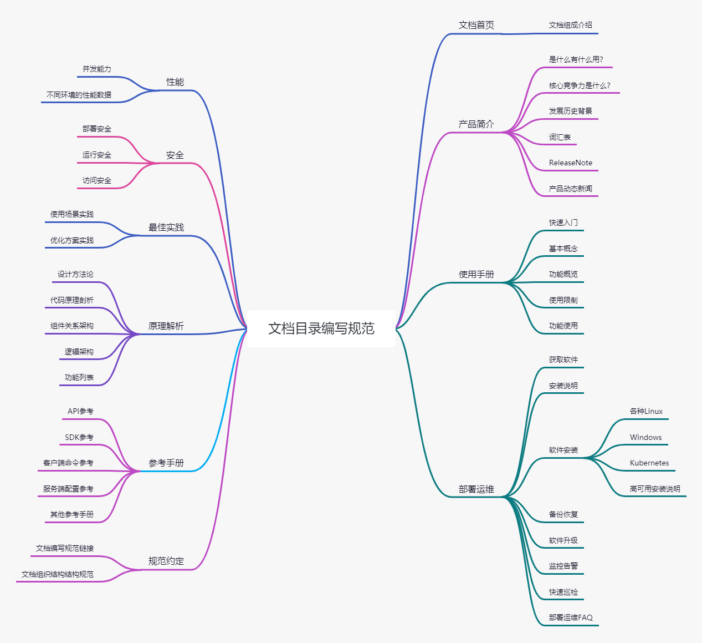

# 文档首页

`文档首页` 作为一个软件的文档的首页，其目的是为用户提供一个整体的视角来了解该软件核心功能，以及相关的文档结构组成，使用能够快速对该产品有一个大致的了解。 

## 产品介绍

通过精炼的词语，点出该产品的功能和适用范围，让读者能够了解该软件的核心功能及作用，以此来判断该产品的定位以及是否需要继续了解下去。

精炼的产品介绍可以参考以下几个方面：

- 该产品的是什么？

对该软件产品进行 `下定义` ，提供一个尽可能精确的定义描述。

`文档目录编写规范` 是对开源软件文档内容归纳的分类参考。让文档输出考虑的范围清晰明确，让读者能够快速根据需要索引到目标知识点。

- 该产品有什么作用？

该产品的核心功能介绍，让读者快速了解到该产品的功能。

`文档目录编写规范` 将常见的开源软件文档归纳为 产品简介、使用手册、部署运维、性能、安全、最佳实践、原理解析、参考手册 和 参考标准 这几大分类，并对每个分类进行精细的描述，为文档编写人员提供对产品全局产品整体的文档目录参考。

- 产品的整体架构是怎样的？

软件产品的整体架构，使读者能够快速的对该产品有个全局性的了解。

`文档目录编写规范`  的整体架构如图：

## 文档组织结构

对主要的一级目录进行介绍，并提供相关的链接跳转。

如果是新手入门可以了解 [快速开始](manual/quick-start.md) ，如果想查找其他资料可以参考一下分类进行

* [产品简介](brief-intro/README.md) ： 对产品的背景进行介绍
* [使用手册](manual/README.md) ： 产品功能的使用说明
* [部署运维](ops/README.md) : 安装部署及运维相关的资料说明
* [性能](perf/README.md) ： 性能相关说明
* [安全](security/README.md) ： 安全相关说明
* [最佳实践](best-practices/README.md) ： 最佳实践相关说明
* [原理解析](principle/README.md) ： 原理解析相关说明
* [参考手册](reference/README.md) ： 相关的参考手册
* [参考标准](reference/README.md) ： 参考的标准